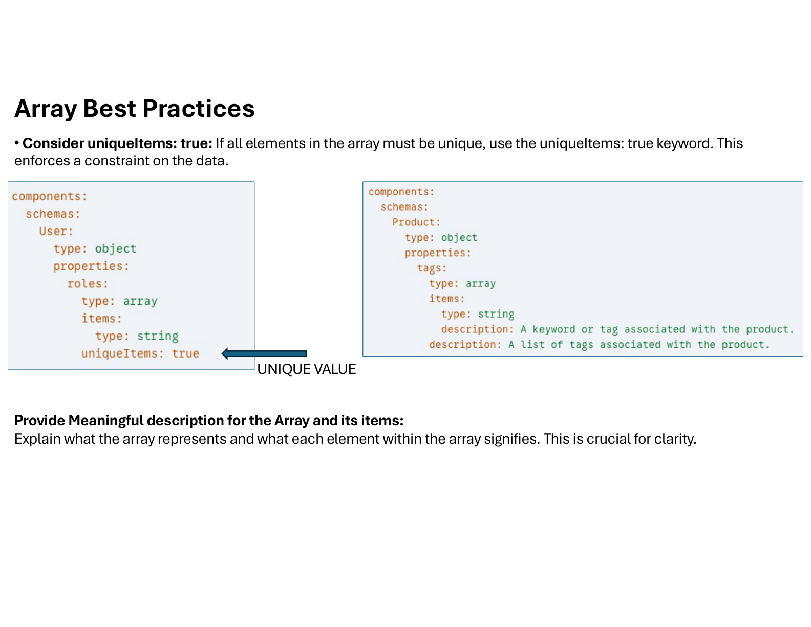

# Array Best Practices

- Define `maxItems` and `minItems`.
  - `maxItems` SHOULD be defined and SHOULD NOT exceed `32767` (default if no better choice exists).
- **Always define `items`** — this is the most crucial rule for arrays.
- Consider `uniqueItems: true` when elements must be unique.
- Document what the array represents and what each element means.
- Model relationships in arrays using `$ref` in the `items` schema.
- Avoid deeply nested arrays unless necessary.

