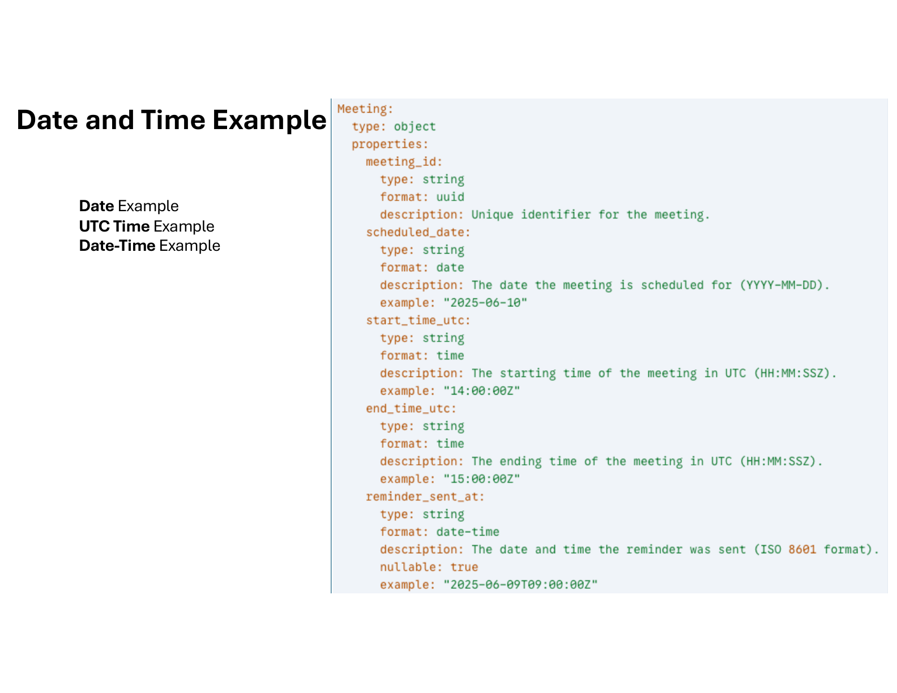

# Date, Time, and Timezones

## UTC Overview

UTC is a time standard (not a time zone). Time zones are offsets from UTC. UTC does not observe daylight saving time and is widely used in technical systems for unambiguous timestamps.

## Rules

- Date and time strings MUST conform to RFC3339 `date-time` format.
- APIs MUST only emit **UTC time** in responses.
- APIs SHOULD accept date-time or time fields with UTC offsets in requests, converting them to UTC for internal storage.
- Offsets MUST NOT be used to derive timezone information.
- If timezone is business-relevant, capture it explicitly using IANA time zone IDs (e.g., `America/Los_Angeles`).
- For floating time values (e.g., date of birth), SHOULD NOT associate them with a timezone.

## Examples

