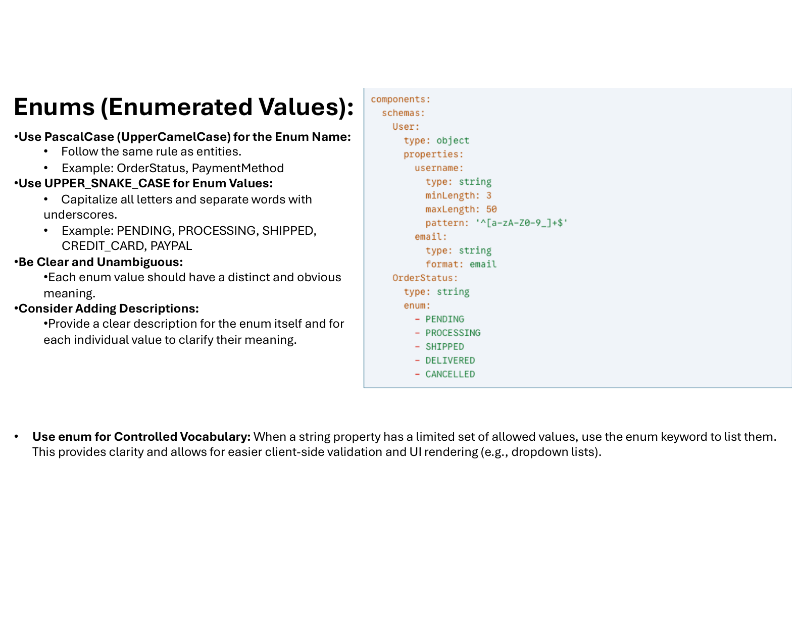

# Enumerations (Enums)

## Naming

- **Enum Name:** PascalCase (UpperCamelCase), like entities.
  - Examples: `OrderStatus`, `PaymentMethod`
- **Enum Values:** UPPER_SNAKE_CASE
  - Examples: `PENDING`, `PROCESSING`, `SHIPPED`, `CREDIT_CARD`, `PAYPAL`

## Controlled Vocabulary

- Use `enum` when the set of allowed values is fixed.
- If new values might be added in the future, **do not** use `enum`. Instead, use `type: string` and document allowed values in `description`, enforcing naming conventions with `pattern`.

