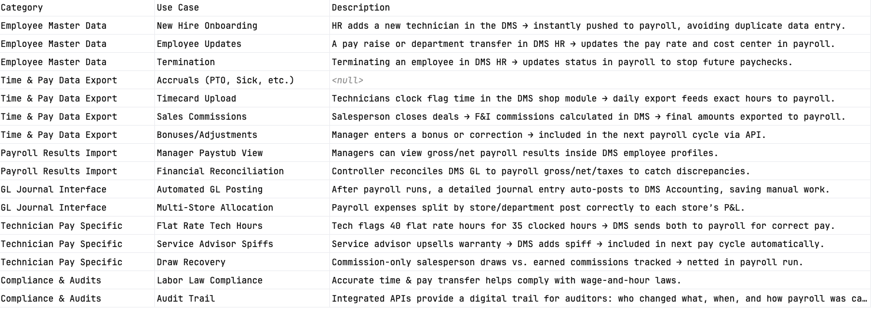

## Five logical domains: **Configuration, Execution, Compensation Logic, Disbursement, and Compliance.**

---

### 1. Payroll Cycle & Schedule Configuration

These use cases test the "Blueprint" of your payroll system (`PayrollCycle`, `EffectivePeriod`, `TimeSlot`).

* **Define Recurring Cycles:** Create a payroll cycle with standard frequencies (Weekly, Bi-Weekly, Monthly).
* **Handle Custom Durations:** Configure a cycle using `DurationUOMTypes.CUSTOM` (e.g., a 10-day cycle).
* **Time-Sensitive Deadlines:** Set up a cycle with a `TimeSlot` and `TimeslotDirectiveTypes` (e.g., "Must be processed BEFORE Friday 5:00 PM").
* **Effective Dating:** Update a payroll cycle's `EffectivePeriod` to expire an old frequency and start a new one without losing historical links.

### 2. Payroll Run Management

These test the "Action" layer where cycles are turned into actual runs (`PayrollRun`, `PayrollRunStatusTypes`).

* **Standard Run Initiation:** Execute a regular run linked to a `PayrollCycle`.
* **Ad-Hoc Processing:** Trigger an `OFF_CYCLE` or `ON_DEMAND` run for a specific set of identifiers.
* **State Machine Validation:** Move a run through the full lifecycle: `CREATED`  `CALCULATING`  `CALCULATION_COMPLETE`  `APPROVED`  `POSTED`.
* **Error Handling:** Simulate a calculation failure to trigger the `ERROR` status and test the recovery/re-run flow.
* **Payment Contexts:** Execute an `ADJUSTMENT` run to correct a previous error vs. a `SETUP` run for new employee onboarding.

### 3. Subject & Product Management

These test the flexibility of who is getting paid (`ProductSubject`, `ResourceTypes`).

* **Multi-Resource Payments:** Process payments for different `ResourceTypes` (e.g., `DEALER_STAFF` vs. `VENDOR` vs. `PARTY`).
* **Contact Method Routing:** Verify that `PayrollPayment` correctly maps to the right `Address` or `CommunicationChannel` for the recipient.
* **Subject Identification:** Ensure that `ProductSubject` can resolve a person/entity using multiple `Identifiers` (e.g., Internal ID vs. External Vendor ID).

### 4. Compensation & Calculation Logic

These test the "Math" and categorization layer (`PayrollComponent`, `PayrollEventTypes`, `Money`).

* **Gross-to-Net Calculation:** Validate that `PayrollComponent` correctly aggregates `GROSS_PAY`, `TOTAL_DEDUCTIONS`, `TOTAL_TAXES`, and `NET_PAY`.
* **Diverse Pay Events:** Verify the system can simultaneously process:
* Earnings: `BONUS_EVENT`, `COMMISSION_EVENT`, `OVERTIME_EVENT`.
* Deductions: `GARNISHMENT_EVENT`, `PRETAX_BENEFIT_EVENT`, `RETIREMENT_PLAN_EVENT`.

* **Employer vs. Employee Share:** Use `PayerTypes` to distinguish between costs paid by the `EMPLOYER` (like payroll tax) and amounts withheld from the `EMPLOYEE`.
* **Multi-Currency Handling:** Process a component in one currency (e.g., USD) and display the `Money` value for a specific locale.
* **YTD Tracking:** Ensure `ytdAmount` in `PayrollComponent` updates correctly after a run is `POSTED`.

### 5. Compliance & Outputs

These test the "Final Result" layer (`PayrollStub`, `TaxReportingContext`).

* **Pay Stub Generation:** Generate a `PayrollStub` that links to a specific `PayrollRun` and includes all `PayrollItems`.
* **Tax Identity Verification:** Ensure the `TaxReportingContext` correctly captures the `employerEin` and the `employeeSsnLastFour` for legal reporting.
* **Audit Trail:** Use the `Identifier` lists across all classes to trace a specific line item on a pay stub back to the original `PayrollCycle` that generated it.

---

### Summary Table for Testing Coverage

| Use Case Category | Primary Class to Watch | Key Enum/Attribute to Test |
| --- | --- | --- |
| **Scheduling** | `EffectivePeriod` | `recurIndicator`, `durationUomType` |
| **Execution** | `PayrollRun` | `payrollRunStatusType` |
| **Payment Logic** | `PayrollPayment` | `paymentExecutionContextTypes` |
| **Taxes/Deductions** | `PayrollComponent` | `payrollEventTypes`, `payerType` |
| **Reporting** | `PayrollStub` | `taxReportingContext`, `ytdAmount` |

 

